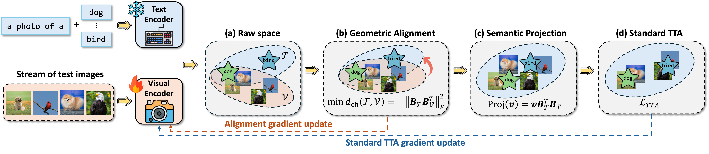
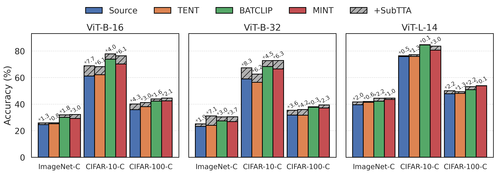

# SubTTA (Subspace Alignment for Vision-Language Model Test-time Adaptation)

<p align="center">
    <a href="https://arxiv.org/abs/2601.08139">
</a>


## 💡 Introduction
This is the official repo for the paper [Subspace Alignment for Vision-Language Model Test-time Adaptation](https://arxiv.org/abs/2601.08139).

<a name="readme-top"></a>

<p align="center">
  <picture>
    <source media="(prefers-color-scheme: dark)" srcset="assets/overview.png">
    
  </picture>
</p>

SubTTA is an online test-time adaptation framework for CLIP-style VLMs that improves adaptation under distribution shifts via subspace alignment. SubTTA enjoys the following key benefits:

- **Modality alignment**: extract and align the principal subspaces of visual and textual features by minimizing their chordal distance

- **Nuisance filtering**: project aligned visual features onto the task-specific textual subspace to suppress task-irrelevant visual noise

- **Plug-and-play TTA**: compatible with common TTA objectives and delivers consistent gains across models and corruption benchmarks

## 📊 Experiment Overview

We evaluate SubTTA on CIFAR-10-C, CIFAR-100-C, and ImageNet-C across multiple CLIP backbones (ViT-B-16, ViT-B-32, ViT-L-14).
- **Consistent gains**: SubTTA boosts Source / TENT / BATCLIP / MINT across datasets and architectures.
<p align="center">
  <picture>
    <source media="(prefers-color-scheme: dark)" srcset="assets/comp_all_models.png">
    
  </picture>
</p>

## ⚙️ Environment Setup
### 1. Clone the repository
```
git clone https://github.com/zhichenz98/SubTTA_EMNLP26.git
cd SubTTA_EMNLP26
```

### 2. Install packages
```
conda env create -f environment.yml
conda activate tta
cd classification
```

### 3. Prepare datasets
Download the corruption benchmarks and place them under `classification/data/` (or set `DATA_DIR` in `conf.py` / CLI).

| Dataset | Download |
|---------|----------|
| CIFAR-10-C | [Zenodo](https://zenodo.org/records/2535967#.ZBiI7NDMKUk) |
| CIFAR-100-C | [Zenodo](https://zenodo.org/records/3555552#.ZBiJA9DMKUk) |
| ImageNet-C | [Zenodo](https://zenodo.org/records/2235448#.Yj2RO_co_mF) |

Expected layout after extraction:

- `data/CIFAR-10-C/`
- `data/CIFAR-100-C/`
- `data/ImageNet-C/<corruption>/<severity>/...`


## 🧪 Running Experiments

### 1. Baselines

#### Option 1: Run via command
```
python test_time.py --cfg cfgs/cifar10_c/source.yaml
python test_time.py --cfg cfgs/cifar10_c/tent.yaml
python test_time.py --cfg cfgs/cifar10_c/mint.yaml
python test_time.py --cfg cfgs/cifar10_c/batclip.yaml
```

#### Option 2: Run via bash file
```
bash sh/source.sh
bash sh/tent.sh
bash sh/mint.sh
bash sh/batclip.sh
```

### 2. SubTTA

SubTTA is selected by `MODEL.ADAPTATION=subtta`. Use `SUBTTA.LOSS_TYPE` to choose the separation / self-training objective: `source`, `tent`, `mint`, or `batclip`.

#### Option 1: Run via command
```
python test_time.py --cfg cfgs/cifar10_c/subtta.yaml SUBTTA.LOSS_TYPE mint
python test_time.py --cfg cfgs/cifar10_c/subtta.yaml SUBTTA.LOSS_TYPE tent
python test_time.py --cfg cfgs/cifar10_c/subtta.yaml SUBTTA.LOSS_TYPE batclip
python test_time.py --cfg cfgs/cifar10_c/subtta.yaml SUBTTA.LOSS_TYPE source
```
- **`--cfg`**: choose from `cfgs/cifar10_c/*.yaml`, `cfgs/cifar100_c/*.yaml`, `cfgs/imagenet_c/*.yaml`.
- **`SUBTTA.LOSS_TYPE`**: choose from `source`, `tent`, `mint`, `batclip`.
- **`SETTING`**: defaults to `reset_each_shift` in `conf.py`; override via CLI only if needed.

#### Option 2: Run via bash file
```
bash sh/subtta.sh [GPU_ID] [LOSS_TYPE]
# Example: bash sh/subtta.sh 0 mint
```

### 3. Run all experiments
```
bash sh/run_all_experiments.sh [GPU_ID]
```

## 🤝 Acknowledgements
This repo is largely built upon the wonderful [test-time-adaptation](https://github.com/mariodoebler/test-time-adaptation).

## 📚 Citation
💫 If you find **SubTTA** helpful, please kindly give us a star and cite below. Thanks!
```
@article{zeng2026subspace,
  title={Subspace alignment for vision-language model test-time adaptation},
  author={Zeng, Zhichen and Bao, Wenxuan and Lin, Xiao and Qiu, Ruizhong and Wei, Tianxin and Ning, Xuying and Yan, Yuchen and Luo, Chen and Cheng, Monica Xiao and He, Jingrui and others},
  journal={arXiv preprint arXiv:2601.08139},
  year={2026}
}
```
